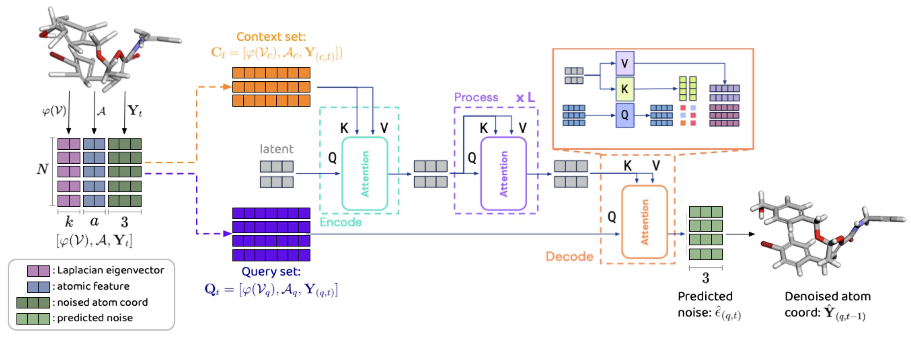

# Simplified Scalable Conformer Generation

---

<div align="center">

This github repository accompanies the research paper, [*Swallowing the Bitter Pill: Simplified Scalable Conformer Generation*](https://arxiv.org/abs/2311.17932) (ICML 2024).


*Yuyang Wang, Ahmed A. Elhag, Navdeep Jaitly, Joshua M. Susskind, Miguel Angel Bautista*

[[`Paper`](https://arxiv.org/abs/2311.17932)]  [[`BibTex`](#citation)]


</div>


## Introduction

In this work, we present Molecular Conformer Fields (MCF), a novel way to predict molecular conformers through a simple formulation that sidesteps many of the heuristics of prior works and achieves state of the art results by using the advantages of scale. Experimental results show that scaling up the model capacity leads to large gains in generalization performance without enforcing inductive biases like translational or rotational equivariance. MCF represents an advance in extending diffusion models to handle complex scientific problems in a conceptually simple, scalable and effective manner.

<div align="center">



</div>


## Installation

We used a docker image with CUDA 12.2, Python 3.10 and Pytorch 2.1.0. To set up the environment: 
```
bash environment/setup.sh
```

## Dataset

To download processed data:
```
mkdir data
wget https://docs-assets.developer.apple.com/ml-research/datasets/mcf/qm9_new/processed_qm9.tar.gz -P data/ # GEOM-QM9
wget https://docs-assets.developer.apple.com/ml-research/datasets/mcf/drugs_new/processed_drugs.tar.gz -P data/ # GEOM-DRUGS
wget https://docs-assets.developer.apple.com/ml-research/datasets/mcf/drugs_new/processed_drugs_test_1000.tar.gz -P data/ # GEOM-DRUGS test set
wget https://docs-assets.developer.apple.com/ml-research/datasets/mcf/xl_new/processed_xl.tar.gz -P data/ # GEOM-XL 
tar -xvzf data/processed_qm9.tar.gz -C data/
tar -xvzf data/processed_drugs.tar.gz -C data/
tar -xvzf data/processed_drugs_test_1000.tar.gz -C data/processed_drugs/
tar -xvzf data/processed_xl.tar.gz -C data/
```

If you want to process your own datasets locally, please refer to `process_data.py`. 

## Train
```
python train_mcf.py --task_config [PATH_TO_CONFIG]
```
The configuration of training models for GEOM-QM9 and GEOM-DRUGS can be found in `configs/qm9_pio.yaml` and `configs/drugs_pio.yaml`.

## Checkpoint & Reproducibility

To download pretrained checkpoints:
```
wget https://docs-assets.developer.apple.com/ml-research/datasets/mcf/ckpts/mcf_ckpts.tar.gz
tar -xvzf mcf_ckpts.tar.gz
```
We provide MCF model trained on GEOM-QM9 (`mcf_qm9.ckpt`) as well as MCF models of different sizes trained on GEOM-DRUGS, including small (S) `mcf_drugs_s.ckpt`, base (B) `mcf_drugs_b.ckpt`, and large (L) `mcf_drugs_l.ckpt`. 

To reproduce the results on GEOM-QM9, run 
```
python test_mcf.py --task_config configs/test_qm9.yaml
```
To reproduce the results on GEOM-DRUGS, run
```
python test_mcf.py --task_config configs/test_drugs.yaml
```

## Visualization
Please refer to `vis.ipynb` to visualize conformers. 

## Citation
If you find our work useful, please consider citing us as:
```
@inproceedings{wang2024swallowing,
    title={Swallowing the Bitter Pill: Simplified Scalable Conformer Generation},
    author={Wang, Yuyang and Elhag, Ahmed A. and Jaitly, Navdeep and Susskind, Joshua M. and Bautista, Miguel {\'A}ngel},
    year={2024},
    booktitle={Forty-first International Conference on Machine Learning},
}
```